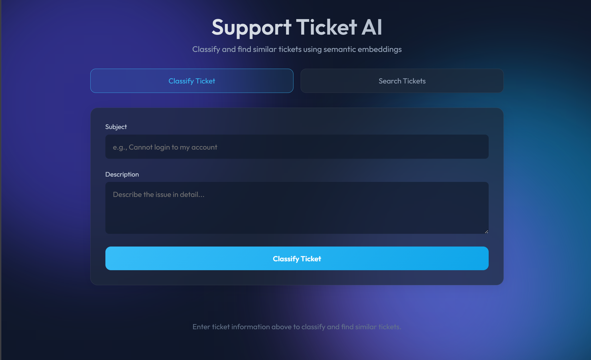
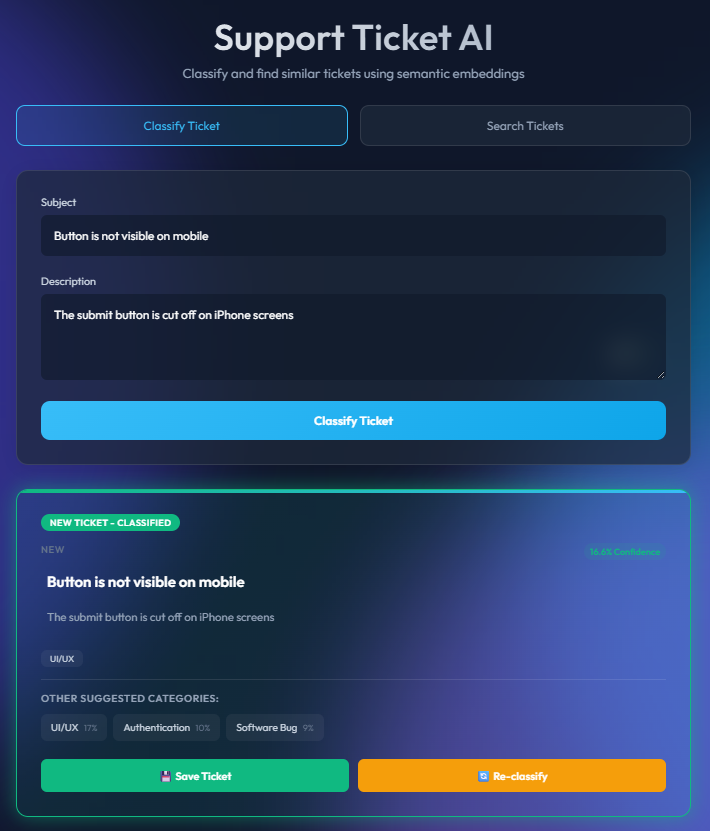
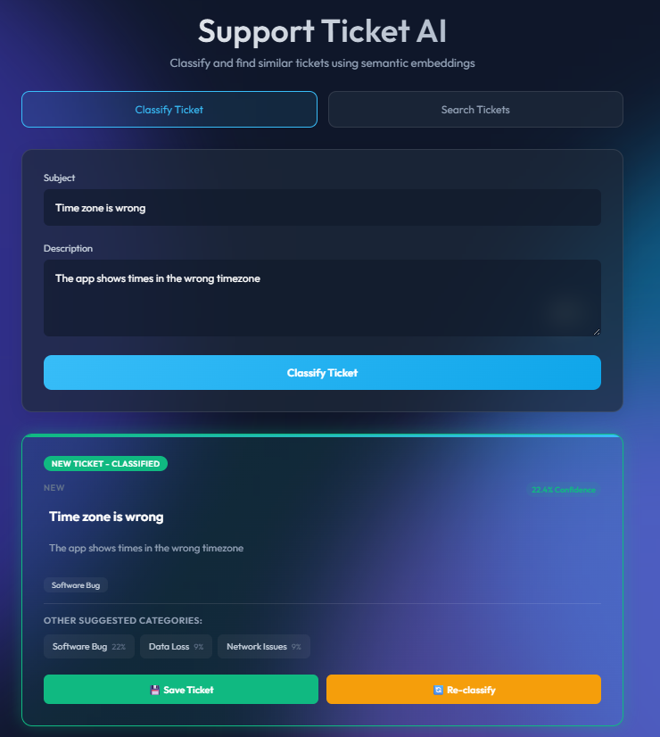
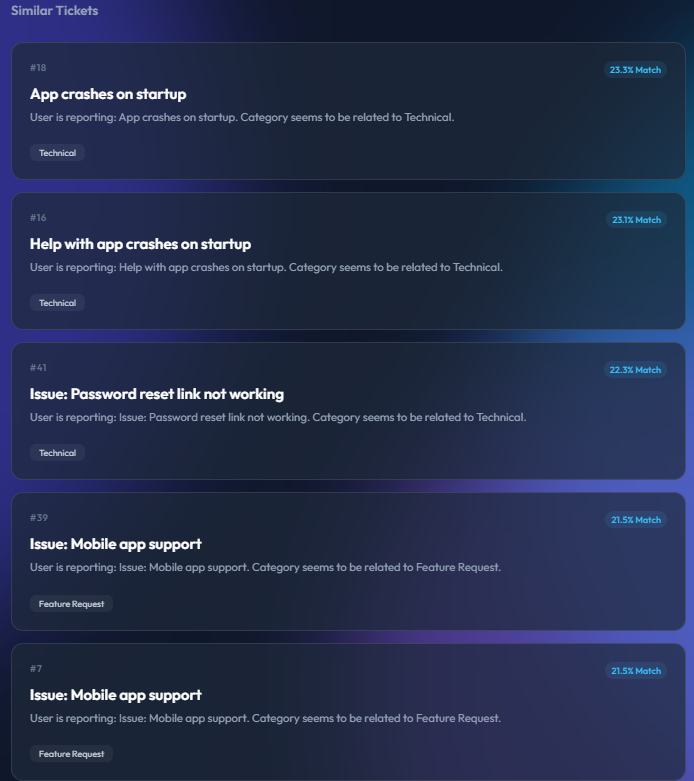
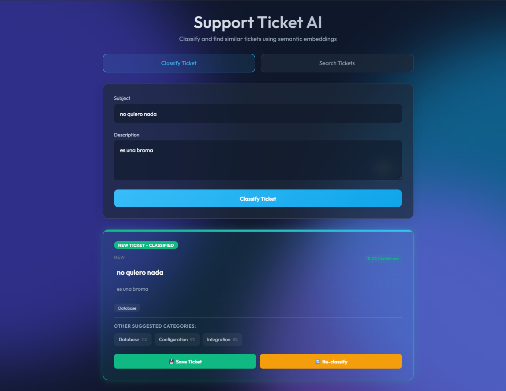
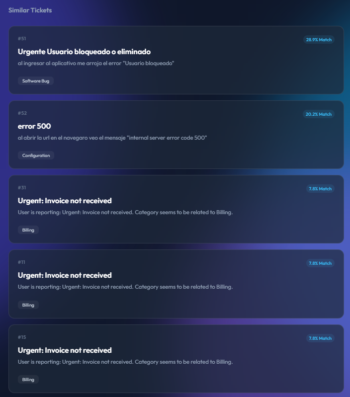
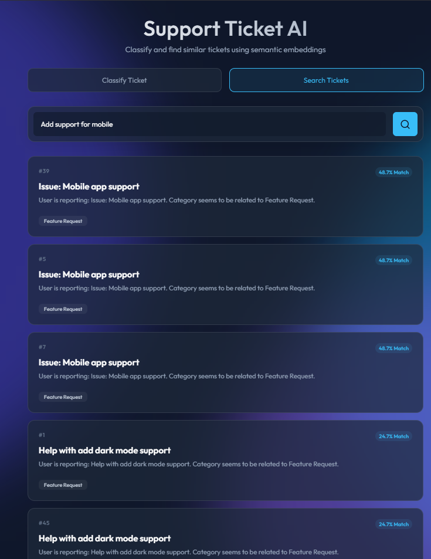
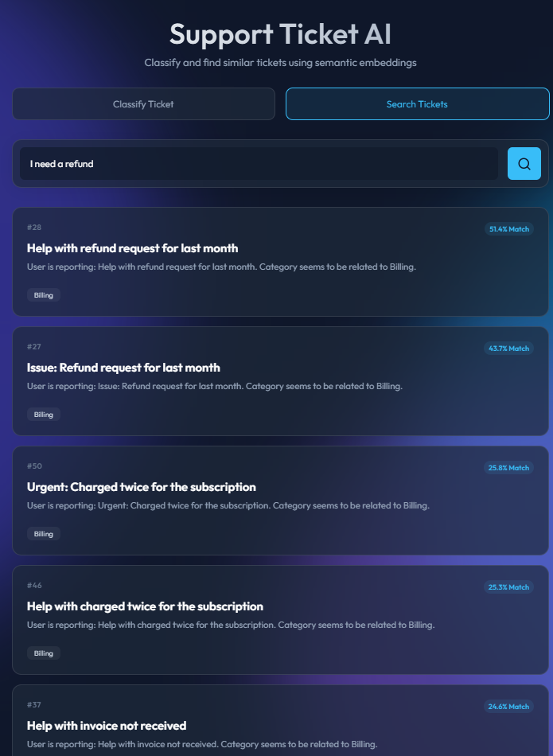

# Evidencias del Proyecto - Support Ticket Embeddings Search

Este documento registra capturas de pantalla del funcionamiento de la aplicación de clasificación y búsqueda de tickets usando embeddings.

---

## 🏠 Pantalla Principal

La interfaz principal muestra dos tabs: **Classify Ticket** y **Search Tickets**.

*Vista inicial de la aplicación con diseño glassmorphic y gradientes animados.*

---
## 🤖 Tab: Classify Ticket

### Ejemplo de Clasificación 1

**Ticket Ingresado:**
- **Subject**: "Button is not visible on mobile
- **Description**: The submit button is cut off on iPhone screens

*El sistema clasifica automáticamente el ticket como "UI/UX"*

#### Tickets similares encontrados

### Ejemplo de Clasificación 2

**Ticket Ingresado:**
- **Subject**: Time zone is wrong"
- **Description**: The app shows times in the wrong timezone

*El sistema clasifica el ticket como "Software Bug"*

#### Tickets similares encontrados

### Ejemplo de Clasificación 3
> **Nota:**
> Validar/Analizar el por que del resultado

**Ticket Ingresado:**
- **Subject**: no quiero nada
- **Description**: es una broma

#### Tickets similares encontrados

---

## 🔍 Tab: Search Tickets

*Resultados de búsqueda semántica muestra:*
- Scores de similitud (% Match)
- Categorías de cada ticket
- Ordenados por relevancia

### Ejemplo de Búsqueda 1

**Query**: "Add support for mobile"

---

### Ejemplo de Búsqueda 2

**Query**: "I need a refund"

## 🔧 Funcionalidades Demostradas

### ✅ Clasificación Automática
- Análisis semántico del texto
- Asignación de categoría con % de confianza
- Sugerencias de categorías alternativas

### ✅ Búsqueda Semántica
- Búsqueda por significado, no solo palabras clave
- Resultados ordenados por similitud
- Scores de match precisos

### ✅ Edición Inline
- Campos editables antes de guardar
- Cambio de categoría con un click
- Re-clasificación con información actualizada

### ✅ Tickets Similares
- Automáticamente encuentra tickets relacionados
- Útil para identificar problemas recurrentes
- Ayuda en la resolución de tickets

### ✅ Interfaz Independiente por Tabs
- Tab "Classify" para nuevos tickets
- Tab "Search" para búsquedas
- Resultados separados y no interfieren entre sí

---

## 🎯 Casos de Uso Demostrados

1. **Clasificación de Tickets Nuevos**: Automatización del proceso de categorización
2. **Búsqueda de Tickets Similares**: Identificación de problemas recurrentes
3. **Gestión de Conocimiento**: Base de datos de tickets para consulta
4. **Soporte Técnico**: Herramienta para agentes de soporte