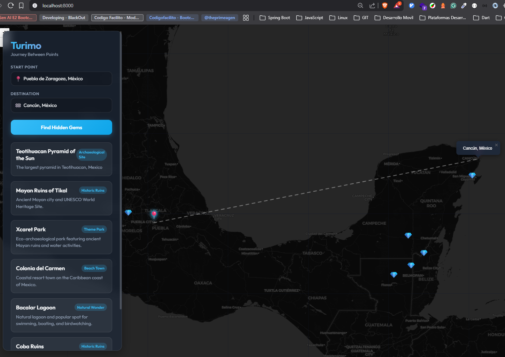
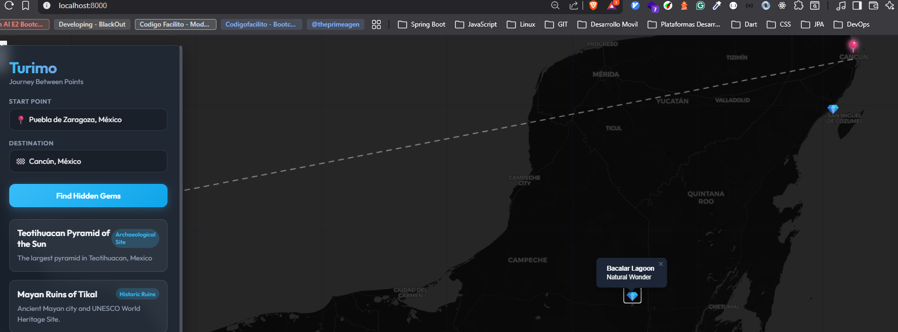
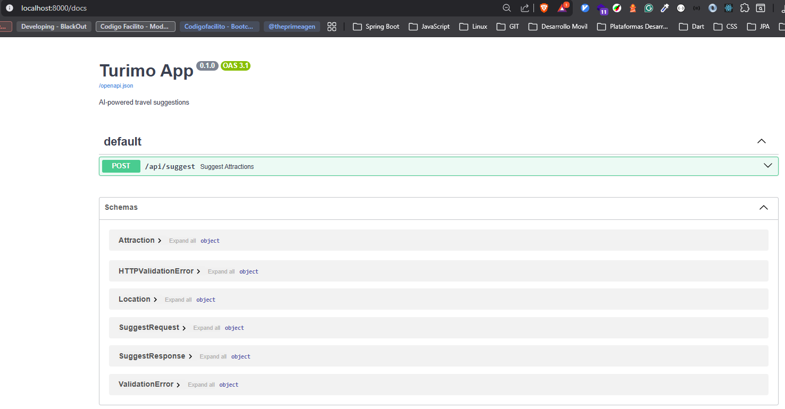

# Evidencias del Proyecto

Este documento registra los prompts utilizados y capturas de pantalla del funcionamiento de la aplicación.

### Prompt inicial
> Genera una aplicación utilizando FastAPI y HTML + Javascript
exponga su LLM, en una app que sugiera exclusivamente los sitios turisticos entro 2 puntos ingresados o seleccionados
expon la app usando uvicorn

> estamos sobore sistema operativo windows, lo que no puedas jecutar en consola dame las indicaciones,
con el resto ayudame a generar la esturctura y archivos del proyecto, si no tienes la capacidad,
dame la estructura del proyecto y el codigo de cada archivo

**Resultado:**
El resultado muestra la interfaz de manera correcta, sin embargo la interacción con el LLM la genro de manera simulada, es decir no cuenta con ninguna comunicación con algun LLM

### Prompt para solicitar la implementación del LLM local ollama3.2
> cambia la interacion con el LLM, necesito que ya no sea un mock,
puedes implementar la interaccion con el LLM ollama llama3.2 lo tengo instalado en local

**Resultado de Búsqueda:**
El resultado muestra un error 500, se dan los detalles en el siguiente prompt

> al ejecutar obtengo este error 
FO:main:Received suggestion request from lat=19.228176737766262 lng=-99.51416015625001 name=None to lat=21.97361354260757 lng=-105.44677734375001 name=None
INFO:main:Sending request to Ollama (llama3.2)...
INFO:httpx:HTTP Request: POST http://localhost:11434/api/generate "HTTP/1.1 200 OK"
INFO:main:Ollama raw response: {
    "name": "Palacio de Bellas Artes",
    "description": "A museum and art nouveau palace in Mexico City.",
    "type": "Landmark",
    "lat": 19.4326,
    "lng": -99.1333
    }...
ERROR:main:General error: main.Attraction() argument after ** must be a mapping, not str
ERROR:main:Error generating suggestions: 500: main.Attraction() argument after ** must be a mapping, not str
INFO:     127.0.0.1:43660 - "POST /api/suggest HTTP/1.1" 500 Internal Server Error

**Resultado de Búsqueda:**
Al consultar la aplicación ya muestra el listado de lugares de manera correcta

### Mejoras
> necesito estos cambios
1.- Mejora la interaccion al seleccionar el origen y destino, en lugar de coordenadas mostrar el nombre de la ciudad, municipio o lugar que corresponde al punto seleccionado
2.- Esta bien el limite de 5 lugares, pero agrega un boton donde mejor se acomode y este inidique mostrar mas resultados, agrega paginación para visualizar los resultados 

#### Capturas de Pantalla

**Nombre de los lugares**

**Boton de mostrar mas resultados**

**Los puntos listados se marcan en el mapa con un icono**

**Al selecionar el lugar en la lista, el mapa te traslada al punto**

**Al dar click en algun punto, muestra el nombre del lugar**

### Documentación API (Swagger)
